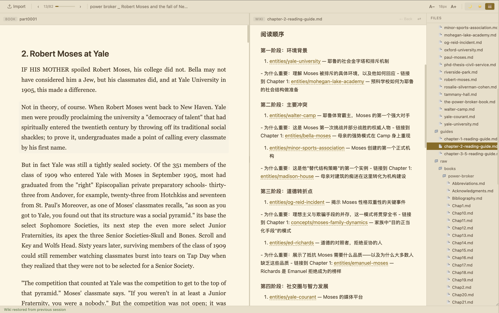

# Wiki Reader

> A dual-pane reading application for EPUB books with LLM Wiki companion pages.
> Read your book on one side, browse related wiki notes on the other.
>
> **Scope:** Browser-only, single-file application. No server required. All data persists locally via IndexedDB.

**English** | [中文](README.zh.md)

[](https://opensource.org/licenses/MIT)



*Dual-pane layout: EPUB on the left, Wiki companion on the right.*

---

## Table of Contents

- [Overview](#overview)
- [Features](#features)
- [Installation](#installation)
- [Quick Start](#quick-start)
- [Usage](#usage)
  - [1. Import your book and wiki](#1-import-your-book-and-wiki)
  - [2. Read and navigate](#2-read-and-navigate)
  - [3. Customize the view](#3-customize-the-view)
- [Project Structure](#project-structure)
- [Dependencies](#dependencies)
- [Browser Support](#browser-support)
- [Data Persistence](#data-persistence)
- [Troubleshooting](#troubleshooting)
- [License](#license)

---

## Overview

Wiki Reader is a browser-based reading environment designed for deep, research-oriented reading. It pairs an EPUB book with a companion wiki (a folder of Markdown files) in a side-by-side layout. The wiki lives inside the reading panel, not as a separate global sidebar, so the focus stays on the content.

**Default assumptions:**

- You have an EPUB book and a set of Markdown wiki notes.
- You want to read the book while cross-referencing your wiki without switching tabs or applications.
- Your data should survive page refreshes and browser restarts.

**Workflow:**

1. Open `index.html` in a browser.
2. Import an EPUB file and a wiki directory (`.md` files).
3. **Start reading.** The book appears on the left, wiki on the right.
   - If your wiki contains a `guilds/` folder, the wiki panel will automatically show a **Guilds** card list for quick access.
4. **Read the book on the left, browse wiki notes on the right.**
5. Click wikilinks to navigate between related wiki pages; use **Back** to return.
6. Swap panels, adjust font size, or switch themes as needed.

---

## Features

| Feature | Description |
|---------|-------------|
| **Dual-pane layout** | EPUB + Wiki side by side, with a draggable divider. |
| **Integrated wiki sidebar** | File tree lives inside the wiki panel, scoped to the current book. |
| **Persistent state** | Imported books and wiki files survive page refresh via IndexedDB. |
| **Three themes** | Dark (default), Light, Sepia — switchable without reload. |
| **Research-backed typography** | Georgia serif for EPUB body text, 18px base, 1.7 line-height. |
| **Font size controls** | A- / A+ buttons with localStorage persistence. |
| **Minimal toolbar** | Chapter navigation, progress bar, book title, font/theme controls. |
| **Wiki navigation history** | Back button with 50-entry history for wikilink traversal. |
| **Swap panels** | Physically swaps DOM order for intuitive layout changes. |
| **Responsive** | Mobile-friendly with media queries. |
| **Keyboard shortcuts** | Escape to close modal. |
| **Zero build step** | Pure HTML/CSS/JS; works directly in any modern browser. |
| **Guild homepage** | Auto-detects `guilds/` directory and shows a card list for quick selection. |

---

## Installation

No installation required for the browser version. Simply open `index.html`.

For local development or future server features:

```bash
git clone https://github.com/EisenJi/wiki-reader.git
cd wiki-reader
npm install
```

Requirements:

- A modern browser (Chrome, Firefox, Safari, Edge)
- Node.js 18+ (only if running the optional local server)

---

## Quick Start

1. **Download or clone** this repository.
2. **Open `index.html`** in your browser.
3. **Click Import** — select:
   - One EPUB file (your book)
   - One directory containing `.md` files (your wiki)
4. **Start reading.** The book appears on the left, wiki on the right.

---

## Usage

### 1. Import your book and wiki

- Click the **Import** button in the toolbar.
- Select an EPUB file.
- Select a folder containing Markdown (`.md`) files.
- The book and wiki are parsed and stored in IndexedDB for persistence.

### 2. Read and navigate

- **Chapter navigation:** Use the dropdown or arrow buttons in the toolbar.
- **Progress bar:** Shows current position in the book.
- **Wikilinks:** Click `[[Wiki Link]]` syntax in wiki pages to jump to related notes.
- **Back button:** Returns to the previous wiki page (up to 50 entries).
- **Swap panels:** Click **⇄ Swap** to exchange the left and right panels.

### 3. Customize the view

- **Font size:** Use **A-** / **A+** buttons.
- **Theme:** Click **🌙** (Dark), **☀️** (Light), or **📜** (Sepia).
- **Panel resize:** Drag the divider between panels.

---

## Project Structure

```
wiki-reader/
├── index.html          # Single-file application (all CSS, JS, HTML inline)
├── README.md           # This file
├── package.json        # Dependencies (JSZip, etc. for future server use)
├── .gitignore
└── docs/
    ├── blog/           # Blog-related documentation
    └── research/       # Research notes and references
```

---

## Dependencies

| Package | Version | Purpose |
|---------|---------|---------|
| `jszip` | ^3.10.1 | Parse EPUB files (ZIP archives containing HTML chapters) |
| `express` | ^5.2.1 | Optional local server (future feature) |
| `ejs` | ^6.0.1 | Optional templating (future feature) |
| `multer` | ^2.2.0 | Optional file upload handling (future feature) |

**Runtime:** None of the above are required for the browser version. Only `jszip` is loaded from CDN in `index.html`.

---

## Browser Support

| Browser | Minimum Version | Notes |
|---------|-----------------|-------|
| Chrome | 90+ | Full support |
| Firefox | 88+ | Full support |
| Safari | 14+ | Full support |
| Edge | 90+ | Full support |

**Required APIs:** IndexedDB, File System Access API (for directory import), CSS Grid, CSS Variables.

---

## Data Persistence

All imported data is stored in the browser's **IndexedDB**:

- EPUB chapters (parsed HTML)
- Wiki file contents (parsed Markdown)
- File tree structure

**Scope:** Data is local to the browser and origin. It survives page refresh and browser restart, but not cache clearing or incognito mode.

**No data is sent to any server.** The application is entirely client-side.

---

## Troubleshooting

| Problem | Cause | Solution |
|---------|-------|----------|
| Import button does nothing | Browser doesn't support File System Access API | Use Chrome, Edge, or Firefox. Safari has limited support. |
| EPUB doesn't parse | EPUB uses non-standard structure | Most standard EPUBs work. Try re-exporting from Calibre. |
| Wiki files not showing | Files don't have `.md` extension | Rename files to `.md`. |
| Data lost after restart | IndexedDB cleared or incognito mode | Use normal browsing mode. Check browser settings for IndexedDB retention. |
| Font size not saving | localStorage disabled | Enable localStorage in browser privacy settings. |

---

## License

MIT
